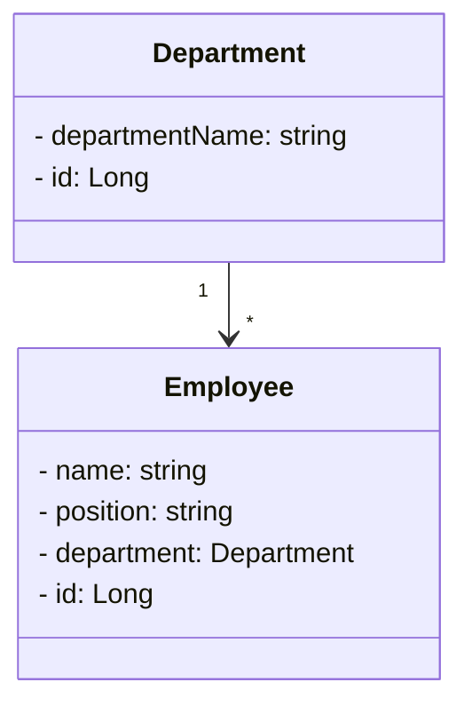

# Company (Service-One)

_Microservice, that does:_
* Get All Employees - GET
* Add new Employee - POST
* Update Employee's position - PUT
* Remove Employee - DELETE


## UML Diagram



## Running the application in dev mode

You can run your application in dev mode that enables live coding using:

```shell script
cd ./company/
./mvnw compile quarkus:dev
```

## Testing the endpoints
you can test the endpoints by go to the below folder ,and you can find the http requests. 
```
/src/main/http
```


> **_NOTE:_**
> * now you can Swagger-Ui at <http://localhost:8080/q/swagger-ui/>.
> * or generate Openapi by <http://localhost:8080/q/openapi/>.

